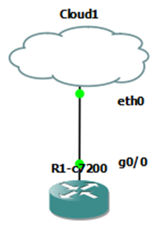

# TRABAJO DE FINAL DE GRADO (TFG) - FINAL DEGREE PROJECT
# AUTOMATIZACIÓN DE REDES INFORMÁTICAS - COMPUTER NETWORK AUTOMATION
## Grado en Ingeniería Telemática - Bachelor's Degree in Telematics Engineering
## By Raquel Riteco Cabañas - Escola Tècnica Superior d'Enginyeria La Salle

### Project structure
[config]  
&nbsp;&nbsp;&nbsp;└── config.yaml  
[inventory]  
&nbsp;&nbsp;&nbsp;├── defaults.yaml  
&nbsp;&nbsp;&nbsp;├── groups.yaml  
&nbsp;&nbsp;&nbsp;└── hosts.yaml  
[db]  
README.md  
requirements.txt  
[src]  
&nbsp;&nbsp;&nbsp;├── [controller]  
&nbsp;&nbsp;&nbsp;├── main.py  
&nbsp;&nbsp;&nbsp;├── [model]  
&nbsp;&nbsp;&nbsp;└── [view]  

- [config]: Directory containing configuration files (config.yaml with the username and password for connecting to a 
device).
- [inventory]: Stores YAML files with inventory settings, including defaults.yaml, groups.yaml, and hosts.yaml.
- [db]: Directory with JSON configuration files for quick deployment. You can also save configurations made through 
the tool.
- README.md: Documentation file that provides an overview of the project.
- requirements.txt: List of Python dependencies required for the project.
- [src]: Main folder containing the project's source code.
  - [controller]: Contains the controllers that manage the business logic and interaction between the model and the 
  view. 
  - main.py: Main entry point of the program.
  - [model]: Contains the data definitions and business logic.
  - [view]: Contains the views that handle user interaction.

### How to execute
<mark>**!! IMPORTANT !! This program only works in a Linux host !! Execution in other OS will fail.**<mark>
- (optional) Create a virtual environment for the project.
  - `python -m venv venv`
  - `source venv/bin/activate`
1. Install the needed packages that are in the requirements.txt file via the command: `pip install -r requirements.txt`
2. Execute the main.py file.
3. ENJOY! 

### Example of a simple virtual environment to use this program in a Windows computer
1. Install VMWare and configure Ubuntu 22:
- Create a virtual machine in VMWare with standard hardware configuration.
- Install Ubuntu 22 with minimum configuration and without downloading updates.
- Set up the user and password.
2. Configure Ubuntu:
- Add a new network interface to VMnet 1 (host-only).
- Set the first network adapter to NAT and add a second network adapter to VMNet 1 (Host-only).
- Update packages: `sudo apt update`
- Install VMWare tools for a better experience: `apt install open-vm-tools`
- Install vim and net: `apt install vim `
- Install network tools: `sudo apt install net-tools`
- Install SSH server: `sudo apt install openssh-server`
- Configure the SSH file: sudo vim /etc/ssh/ssh_config (Port 22, Ciphers uncommented, Hash Known Hosts No)
- Restart the virtual machine: `reboot`
3. Install GNS3 VM:
- Disable Hyper-V in Windows.
- Follow the GNS3 VM installation process.
- Leave the first network adapter in Host-only and the second in NAT.
- Verify connectivity between the Ubuntu VM and GNS3 VM using ping.
4. Import Cisco vIOS into GNS3 VM:
- Download the Cisco router image.
- Install the image on the GNS3 server and select the appropriate version.
5. Enable Old SSH Algorithms: To connect to older versions of Cisco routers, you must enable old SSH algorithms.
6. Install VS Code:
- Download and install VS Code from the official website.
- Install the remote development extension pack.
- Connect to the Ubuntu VM via SSH from VS Code.
- If connection errors occur, edit the known_hosts file on the host: Users/User/.ssh/known_hosts and delete the lines 
corresponding to the Ubuntu VM IP.
7. Configure scenario in GNS3:
- Create a project and deploy the following scenario with a Cloud GNS3 machine:

- Perform basic configuration to enable SSH connection on the router.  
`conf t`  
`int g0/0`   
`ip address 192.168.174.200 255.255.255.0`   
`no shut`   
`exit`  
`ip domain-name cisco.com`  
`username user privilege 15 secret pass`   
`crypto key generate rsa`   
`1024`   
`ip ssh version 2`   
`line vty 0 15`   
`transport input ssh`   
`login local`   